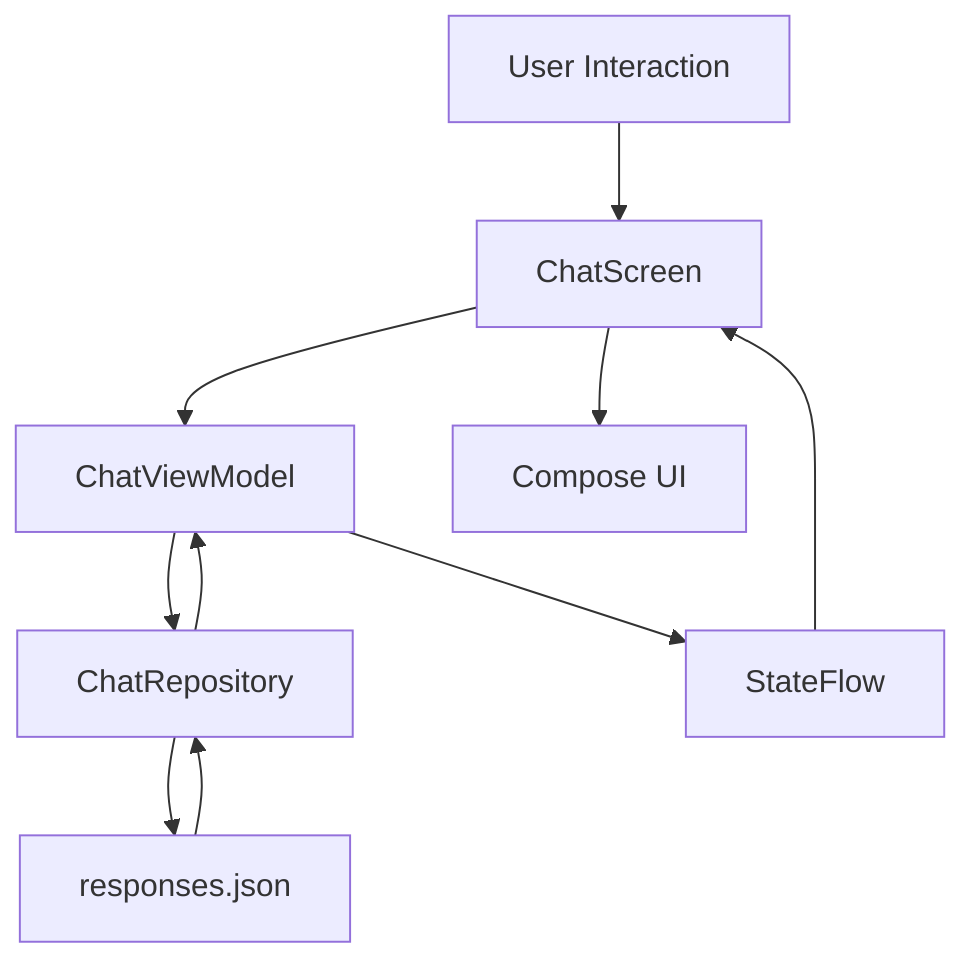

# ✨ AI Styling Assistant

> A modern Android styling assistant prototype built with **Kotlin, Jetpack Compose, MVVM, StateFlow, and Kotlin Coroutines**, designed around a conversational chat experience for makeup, hair-care, and styling guidance.

<p align="center">
  
  
  
  
  
</p>

---

## 📱 Overview

**AI Styling Assistant** is an Android chat experience designed to help users with everyday styling-related questions such as:

* Makeup tips
* Hair-care guidance
* Styling suggestions
* Salon booking assistance
* Occasion-based preparation tips

The application focuses on a modern conversational UX with **quick suggestion actions, animated responses, auto-scrolling chat, typing indicators, and a dedicated voice-mode interface**.

### Important implementation detail

The current version is a **self-contained prototype**.

It does **not** call an external AI/LLM service. Assistant responses are stored locally in:

```text
app/src/main/assets/responses.json
```

The repository layer loads these responses and selects an appropriate response based on the user's input or selected suggestion.

This makes the project useful as an example of **Android UI architecture, reactive state management, local data handling, and conversational UX design** while keeping the application fully runnable without API keys or backend services.

---

## 🎯 Key Features

### 💬 Conversational Chat UI

* User and assistant message bubbles
* Reactive message list
* Automatic scrolling to the latest message
* Intro state before the conversation begins
* Dedicated chat state after the first user interaction

### ⚡ Quick Suggestions

Predefined actions help users start a conversation immediately:

* **Monsoon Make-Up Tips**
* **Need Booking Helps**
* **Quick Ready Tips**
* **Get Ready for Birthday**

Suggestions are mapped to response categories stored in the local JSON data source.

### ⌨️ Simulated Assistant Typing

The application provides a conversational feel by:

1. Adding the user's message immediately
2. Showing an animated typing indicator
3. Waiting for a short coroutine delay
4. Resolving a response from the repository
5. Displaying the assistant message

### 🎨 Modern Compose UI

Built completely around Jetpack Compose and Material 3 concepts with:

* Dark visual language
* Custom color palette
* Rounded surfaces
* Gradient assistant avatar
* Responsive layouts
* Animated message appearance
* Custom suggestion chips

### 🎙️ Voice-Mode UI

The project also contains a dedicated voice-mode experience with:

* Assistant-focused screen
* Large assistant visual
* Microphone interaction
* Minimize/return interaction
* AI-generated content disclaimer

> Voice recognition itself is not connected to a speech-to-text service in the current implementation; the current functionality focuses on the UI/interaction layer.

---

# 🏗️ Architecture

The application follows an **MVVM-inspired architecture** with clear separation between UI, state management, and data access.



## Architecture Responsibilities

### UI Layer

Responsible for:

* Rendering the chat experience
* Handling user interactions
* Rendering suggestions
* Displaying typing state
* Rendering voice-mode UI
* Animations and visual feedback

Primary entry:

```text
ui/ChatScreen.kt
```

### ViewModel Layer

`ChatViewModel` acts as the presentation-state owner.

Responsibilities include:

* Maintaining chat messages
* Exposing observable UI state
* Processing user messages
* Handling suggestion actions
* Triggering asynchronous responses
* Managing typing state

State is exposed using:

```kotlin
StateFlow<List<ChatMessage>>
```

and:

```kotlin
StateFlow<Boolean>
```

### Data Layer

`ChatRepository` isolates response retrieval from the UI.

Responsibilities include:

* Loading the local JSON response dataset
* Mapping user input to response categories
* Selecting a response
* Creating assistant/user message models

This keeps response/data handling outside the Composable layer.

---

# 🔄 Data Flow

The core interaction flow is:

```text
User
 │
 ▼
ChatScreen
 │
 ▼
ChatViewModel
 │
 ├── Add user message
 │
 ├── Set typing = true
 │
 ▼
ChatRepository
 │
 ├── Read responses.json
 │
 ├── Resolve response category
 │
 └── Select response
 │
 ▼
ChatViewModel
 │
 ├── Add assistant message
 └── Set typing = false
 │
 ▼
StateFlow
 │
 ▼
Jetpack Compose recomposition
 │
 ▼
Updated Chat UI
```

---

# 🧩 Project Structure

```text
AI_Styling_Assistant/
│
├── app/
│   └── src/
│       └── main/
│           │
│           ├── java/
│           │   └── com/example/aistyling/
│           │       │
│           │       ├── data/
│           │       │   ├── ChatRepository.kt
│           │       │   └── models/
│           │       │       └── ChatMessage.kt
│           │       │
│           │       ├── ui/
│           │       │   ├── ChatScreen.kt
│           │       │   ├── componets/
│           │       │   │   └── SuggestionChip.kt
│           │       │   └── theme/
│           │       │       └── Theme.kt
│           │       │
│           │       ├── vm/
│           │       │   └── ChatViewModel.kt
│           │       │
│           │       └── MainActivity.kt
│           │
│           └── assets/
│               └── responses.json
│
├── gradle/
│   └── libs.versions.toml
│
├── build.gradle.kts
├── settings.gradle.kts
├── gradle.properties
├── gradlew
├── gradlew.bat
└── README.md
```

---

# 🛠️ Tech Stack

| Category              | Technology                     |
| --------------------- | ------------------------------ |
| Language              | Kotlin                         |
| UI                    | Jetpack Compose                |
| Design System         | Material 3                     |
| Architecture          | MVVM                           |
| State Management      | StateFlow                      |
| Async Programming     | Kotlin Coroutines              |
| Lifecycle             | AndroidX Lifecycle / ViewModel |
| Build System          | Gradle Kotlin DSL              |
| Android Gradle Plugin | 8.12.3                         |
| Kotlin                | 2.0.21                         |
| Compose BOM           | 2024.10.00                     |
| Minimum SDK           | 24                             |
| Target SDK            | 36                             |
| Compile SDK           | 36                             |
| Java                  | 11                             |

---

# 🎨 UI & UX

The application is designed around a modern dark conversational interface.

### Chat Experience

```text
┌─────────────────────────────────┐
│  AI Assistant             ⋮     │
│  Chat for Styling Tips          │
├─────────────────────────────────┤
│                                 │
│        Hello Sanjeet            │
│                                 │
│ Need tips on makeup, stylist    │
│ or hair care?                   │
│                                 │
├─────────────────────────────────┤
│ [Monsoon Make-Up Tips]          │
│ [Need Booking Helps]            │
│ [Quick Ready Tips]              │
│ [Get Ready for Birthday]        │
├─────────────────────────────────┤
│ 50%  Help AI to Complete...  →  │
├─────────────────────────────────┤
│ Chat With AI...           🎙  ➤ │
└─────────────────────────────────┘
```

The actual implementation includes:

* Conditional intro state
* Suggestion grid
* Scrollable message history
* Animated message appearance
* Animated typing dots
* Custom assistant avatar
* Rounded chat bubbles
* Progress card
* Input and send controls
* AI-generated content disclaimer

---

# 🗂️ Local Response Model

Responses are organized by category inside:

```text
responses.json
```

Example structure:

```json
{
  "quick_ready_tips": [
    "...",
    "...",
    "..."
  ],
  "monsoon_makeup_tips": [
    "...",
    "...",
    "..."
  ],
  "need_booking_helps": [
    "...",
    "...",
    "..."
  ],
  "get_ready_for_birthday": [
    "...",
    "...",
    "..."
  ],
  "makeup_tips": [
    "...",
    "..."
  ],
  "hair_care": [
    "...",
    "..."
  ],
  "default": [
    "..."
  ]
}
```

The repository normalizes the requested key and selects a response from the matching JSON array.

---

# ⚙️ Core Implementation Highlights

## Reactive UI State

The ViewModel exposes immutable `StateFlow` streams for Compose to observe:

```kotlin
private val _messages =
    MutableStateFlow<List<ChatMessage>>(emptyList())

val messages: StateFlow<List<ChatMessage>> = _messages
```

This keeps UI state observable and allows Compose to react to state changes.

## Coroutine-Based Interaction

The assistant response flow is handled using `viewModelScope`:

```kotlin
viewModelScope.launch {
    _isBotTyping.value = true

    delay(700)

    val reply = repo.getAiReplyFor(key)

    delay(400)

    _messages.value =
        _messages.value + repo.aiMessage(reply)

    _isBotTyping.value = false
}
```

This demonstrates asynchronous UI interaction without blocking the main thread.

## Repository-Based Data Access

The UI does not directly read the JSON asset.

Instead:

```text
UI
 ↓
ViewModel
 ↓
Repository
 ↓
JSON Asset
```

This separation makes the data source easier to replace with an API or database later.

---

# 🚀 Getting Started

## Prerequisites

Make sure you have:

* Android Studio
* JDK 11+
* Android SDK 36
* Android device or emulator
* Gradle 8+

Minimum supported Android version:

```text
Android API 24
```

---

## Clone the Repository

```bash
git clone https://github.com/BabluandroidDev/AI_Styling_Assistant.git

cd AI_Styling_Assistant
```

---

## Open in Android Studio

1. Open Android Studio
2. Select **Open**
3. Choose the cloned `AI_Styling_Assistant` directory
4. Allow Gradle synchronization to complete
5. Start an emulator or connect a physical Android device
6. Run the `app` configuration

No external AI API key is required for the current version.

---

# 🧪 Current Project Scope

This repository currently focuses on the **Android UI, architecture, state management, and conversational interaction prototype**.

### Implemented

* ✅ Jetpack Compose UI
* ✅ Material 3 styling
* ✅ MVVM structure
* ✅ ViewModel state management
* ✅ StateFlow
* ✅ Kotlin Coroutines
* ✅ Repository abstraction
* ✅ Local JSON response source
* ✅ Quick suggestion flows
* ✅ Animated typing indicator
* ✅ Message animations
* ✅ Automatic chat scrolling
* ✅ Voice-mode UI
* ✅ Responsive conversational layout

### Not Yet Implemented

* ⏳ Real LLM / AI API integration
* ⏳ Speech-to-text / real voice interaction
* ⏳ Chat history persistence
* ⏳ Room / DataStore persistence
* ⏳ Dependency injection with Hilt/Koin
* ⏳ Automated unit tests
* ⏳ Automated UI tests
* ⏳ Production backend integration
* ⏳ Authentication and user profiles

---

# 🧭 Production Evolution Roadmap

A natural next step for this prototype would be to evolve the local response engine into a production-ready AI architecture.

### Phase 1 — Architecture Hardening

* Introduce domain/use-case layer
* Add Hilt for dependency injection
* Introduce explicit UI state models
* Improve error and loading handling
* Add unit tests for ViewModel and Repository

### Phase 2 — Real AI Integration

Replace the JSON-backed response source with a remote AI service:

```text
Compose UI
    ↓
ViewModel
    ↓
Use Case
    ↓
Repository Interface
    ↓
Remote Data Source
    ↓
AI / LLM API
```

### Phase 3 — Persistence

Add:

* Room
* DataStore
* Conversation history
* User preferences
* Saved styling recommendations

### Phase 4 — Voice Experience

Add:

* Speech recognition
* Voice activity handling
* Text-to-speech responses
* Conversation state synchronization

### Phase 5 — Production Readiness

* Automated testing
* CI/CD
* Crash monitoring
* Analytics
* Secure API handling
* Release builds with proper shrinking/obfuscation
* Performance profiling

---

# 🔍 Engineering Takeaways

This project demonstrates several practical Android engineering concepts:

**Declarative UI**

Jetpack Compose is used to build reusable and state-driven UI components.

**Unidirectional State Flow**

User actions update ViewModel state, which is observed by Compose.

**Separation of Concerns**

UI rendering, state management, and data access are separated into dedicated layers.

**Asynchronous Programming**

Kotlin Coroutines handle background work and simulated response timing.

**Reusable Components**

Elements such as message bubbles, suggestion chips, typing indicators, input controls, and assistant avatars are isolated into reusable Composable functions.

**Data Source Abstraction**

The Repository acts as the boundary between presentation logic and response data, making future migration to a network-based backend easier.

---

# 📈 Why This Project Matters

Although the current implementation is intentionally lightweight, the project demonstrates a useful foundation for a modern Android conversational product.

The architecture can be extended from:

```text
Local JSON Responses
```

to:

```text
Remote AI Service
        +
Conversation History
        +
User Profile
        +
Personalized Recommendations
        +
Voice Interaction
```

without coupling the UI directly to the underlying response source.

---

# 📌 Project Status

**Status:** Prototype / Architecture & UI Demonstration

**Current Response Engine:** Local JSON dataset

**External AI Dependency:** None

**Backend Dependency:** None

**API Keys Required:** No

---

# 👨‍💻 Author

### Bablu Gupta

**Senior Android Developer**

Focused on building scalable Android applications, modern mobile experiences, and maintainable software architecture.

🌐 **Portfolio:**
https://babluandroiddev.github.io

🐙 **GitHub:**
https://github.com/BabluandroidDev

💼 **LinkedIn:**
Add your LinkedIn profile here

---

# ⭐ Support

If you find this project useful or interesting, consider giving the repository a ⭐.

---

<p align="center">
  Built with Kotlin + Jetpack Compose
</p>
